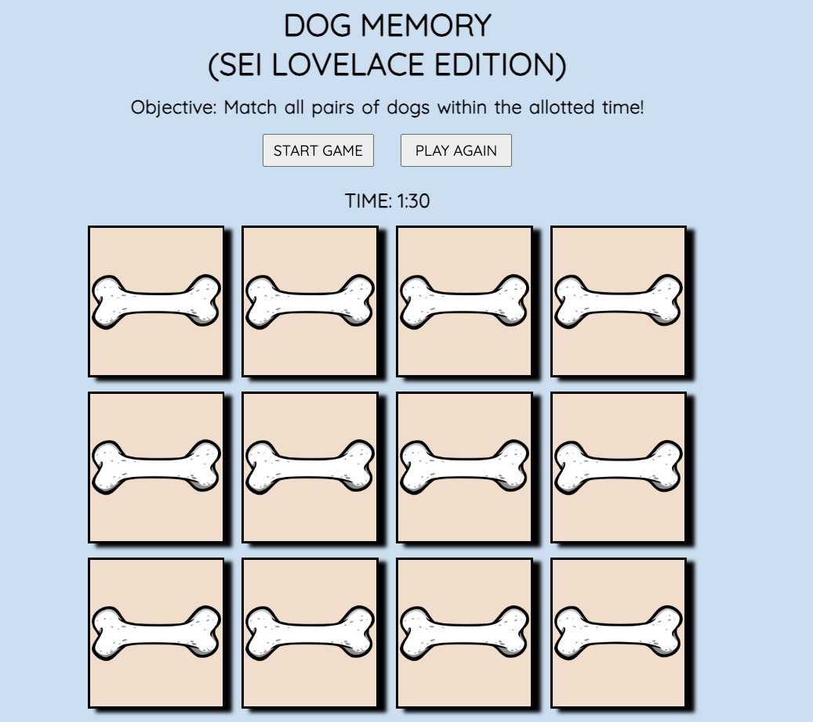

# DOG MEMORY (SEI Lovelace Edition)
    
### A Memory/Concentration game starring the pups of the SEI Lovelace Cohort.
### Objective of the game is to find all the matching pairs before time runs out.
### The player has 90 seconds to find 6 pairs (12 cards total).

    

### Technologies Used
   
    1. HTML
    2. CSS
    3. JavaScript
    
### Link to Game: [DOG MEMORY](https://shaneyoung91.github.io/Memory-Concentration-Game/)
    - Click "Start Game" to begin play

   
### Future Enhancements
   - [ ] Moving animations game is in play (dog walking/running)
   - [ ] Animations for win/lose message in lightbox
   - [ ] Animations to timer
