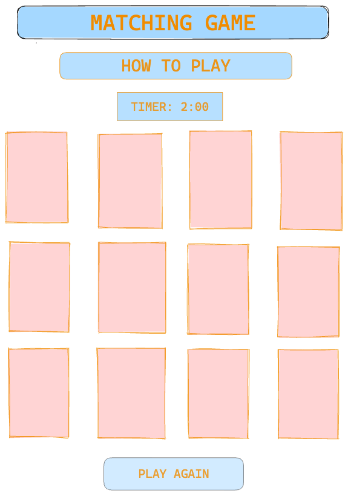

# Memory/Concentration Game

## Wireframe

## Psuedocode

1. Define required constants:
     - pictures (for cards)
       - store pictures in array

2. Define required variables used to track the state of the game:
     - cards
       - use `
` and access via DOM
     - selection (first click, second click)
     - winner
     - countdown timer
     
3. Functions needed
     - shuffle cards
          -  Fisher-Yates shuffle algorithm (had to Google)
     - assign pictures to the cards
          -  create `` elements for each card (via DOM) and link to 
     - handle click events
          - start game and timer on initial click        
          - track click one/two and switch back & forth
          - "flip" cards with click one/two
     - check for a match
          - if match, keep cards "flipped up", keep playing
          - if no match, turn cards over, keep playing
     - countdown timer
          - if all cards are not face up before timer reaches 0, declare loser
     - check winner
          - if all cards are face up, declare winner
