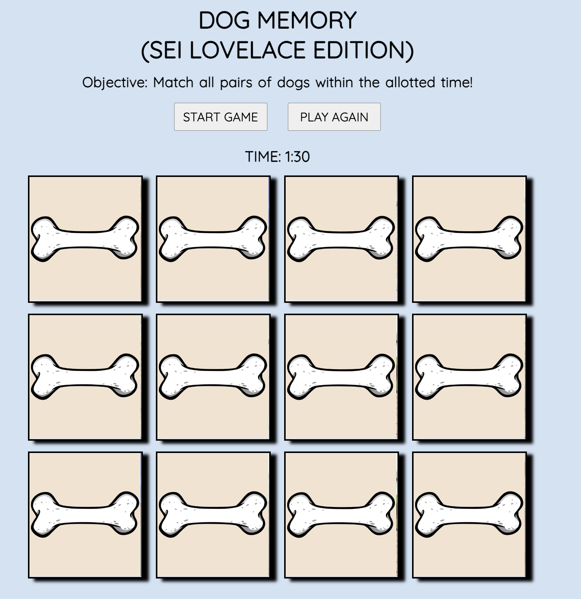
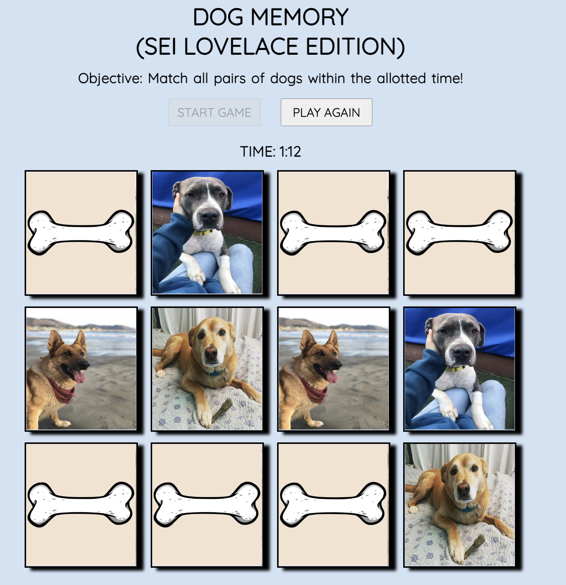
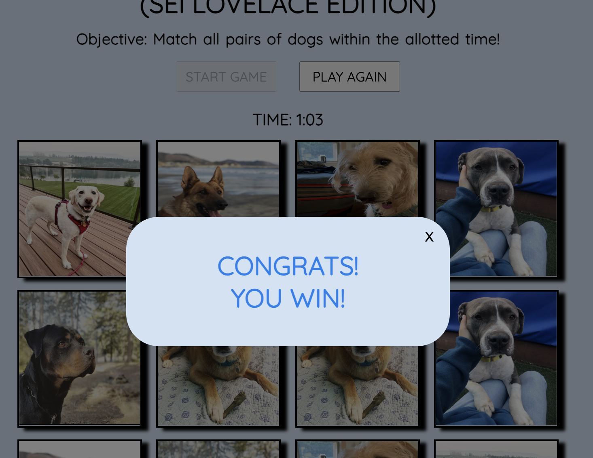
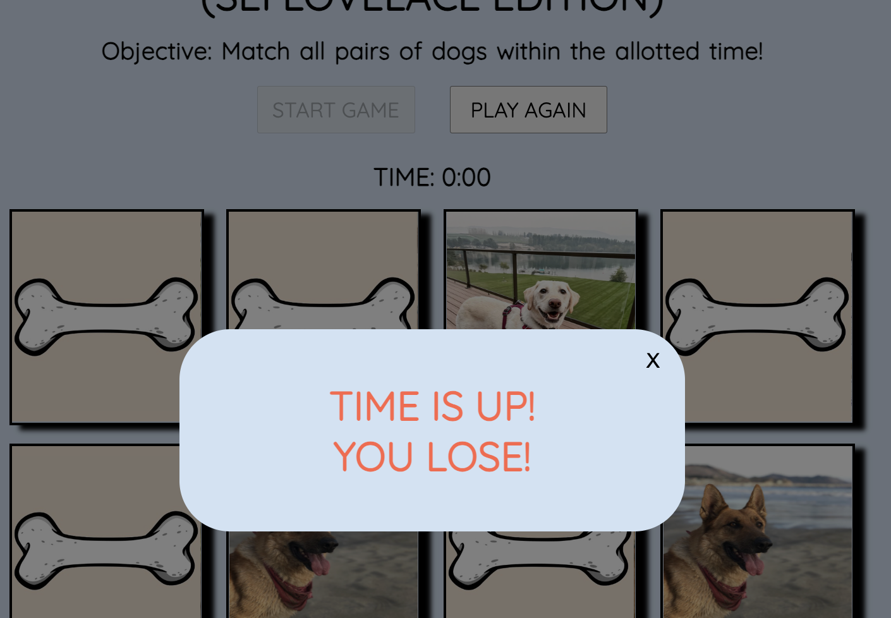

# :dog: DOG MEMORY (SEI Lovelace Edition) :dog:
    
###  Memory/Concentration game - Starring the Pups of the SEI Lovelace Cohort
---
## Link to Game :link:
[DOG MEMORY](https://shaneyoung91.github.io/Memory-Concentration-Game/)

---

## How to Play :joystick:
1. Open the game in your web browser.
2. Click on the "Start Game" button to begin play. The timer will start counting down.
3. The cards are displayed face-down on the screen. Click on any two cards to reveal their faces.
4. If the two revealed cards match, they will remain face-up, and you can proceed to the next pair.
5. If the two revealed cards do not match, they will be flipped back face-down.
6. Continue revealing cards and trying to match them until you find all six pairs.
7. The game ends when you successfully match all pairs or when the timer runs out.
8. If you complete the game before the timer reaches zero, you win! Otherwise, you lose.
9. You can choose to restart the game, at any point, by clicking the "Play Again" button.
---
## Initial Game State

---
---
## Game In-Play

---
---
## Game Winner / Loser Message


---
---
## Code Preview
```js
function checkForMatch() {   // If match, remove selected class and add match class
    if (selectedCards[0].nextElementSibling.src === selectedCards[1].nextElementSibling.src) {
      selectedCards.forEach((card) => {
        card.classList.remove('selected');
        card.classList.add('match');
        card.nextElementSibling.style.pointerEvents = "none"; // Guard rail
        card.parentElement.style.pointerEvents = "none"; // Guard rail 
      })
    } else {  // If no match, remove class from cards in array
        selectedCards.forEach((card) => {
          card.classList.remove('selected', 'flipUp');
          card.style.opacity = "1";
          card.style.transition = "visibility 1s, opacity 1s linear";;
      });
    }
  // Re-enable card clicks and reset array to empty
  cards.forEach((card) => card.addEventListener('click', handleClick));
  selectedCards = [];
}
```

```js
function checkForWin() { // If all back-card elements DO NOT contain class 'match', set winner to 'false', else set to 'true' and return message
  for (let i = 0; i < backCardEl.length; i++) {
    const backCard = backCardEl[i];
    if (countdownTimer === -1) {
      stopTimer();
      cards.forEach((card) => card.removeEventListener('click', handleClick));
      showLightbox();
      return lightboxMessage.innerHTML = `<h1 style="color:#FF6347">TIME IS UP!<br>YOU LOSE!</h1>`;
    }
    if (!backCard.classList.contains('match')) {
      winner = false;
      break;
  } else {
    winner = true;
  }
}
  if (winner === true) { // Remove click from cards when winner or loser is declared
    stopTimer();
    cards.forEach((card) => card.removeEventListener('click', handleClick));
    showLightbox();
    return lightboxMessage.innerHTML = `<h1 style="color:#0B81F0">CONGRATS!<br>YOU WIN!</h1>`;
  }
 }
```
---
## Technologies Used
 
 
 

---

## Future Enhancements
   - [ ] Moving animation while game is in play (i.e. dog walking/running)
   - [ ] Animations (visual or audio) for win/lose messages
   - [ ] Visual animation to timer (green, yellow, red to signify time left)
---

## Credits
:camera_flash: Photos Provided By :camera_flash:
- Selin B.
- Lauren J.
- Samantha F.
- Payne F.
---